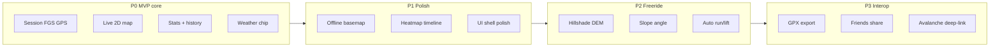

# SkiSnow — Full Application Development Plan

**Date:** 2026-07-21  
**Status:** living plan — advance via GitHub Issues + PRs  
**Product sources:** `docs/product/*`, `docs/adr/*` (accepted)

---

## Vision

One Android app for resort + freeride: **record the ski day**, live **2D→3D map**, elevation/speed stats, **mountain weather**, local-first history never paywalled.

---

## Screen map (full UI)

| # | Screen | Phase | Description |
|---|--------|-------|-------------|
| 1 | **Session / Live map** | P0 | Start/Pause/Stop, polyline, live stats, weather chip |
| 2 | **History list** | P0 | Offline list of ski days |
| 3 | **Session detail** | P0.5 | Full map replay, elevation chart, stats cards |
| 4 | **Settings** | P1 | Units metric/imperial, map style, about, privacy |
| 5 | **Offline packs** | P1 | Download region for freeride |
| 6 | **Timeline / heatmap** | P1 | Day replay scrubber + speed colors |
| 7 | **Terrain layers** | P2 | Hillshade + slope-angle toggles |
| 8 | **Export share sheet** | P3 | GPX/FIT share |

Navigation target: single-activity `NavHost` — **Session | History | Settings**.

---

## PR / milestone pipeline

Work **one PR at a time**: implement → tests green → fill PR checklist → merge → next.

| PR | Title | Deliverables | Exit criteria | Status |
|----|-------|--------------|---------------|--------|
| **#0** | fix: StopSession STOPPING finalize | Domain fix + unit tests | `:domain:test` green | in progress |
| **#1** | docs: roadmap + GitHub house style | Plan, README, PR/issue templates, LICENSE | Docs only | next |
| **#2** | feat: session detail + elevation chart | Detail screen, nav from history | UI + unit stats series | planned |
| **#3** | feat: settings + units preference | DataStore prefs, metric default | Preference persists | planned |
| **#4** | feat: offline basemap packs | MapLibre offline region API | Download + use offline | planned |
| **#5** | feat: speed heatmap + timeline | Polyline coloring + scrubber | Replay day | planned |
| **#6** | feat: hillshade DEM layer | ADR-0006 phase A | Toggle hillshade | planned |
| **#7** | feat: slope-angle layer | Freeride safety context | Layer + legend | planned |
| **#8** | feat: auto run/lift segments | Segment model + UI chips | Stats on DESCENT only | planned |
| **#9** | feat: GPX export | Share sheet | File opens in third-party | planned |
| **#10** | feat: design system polish | Tokens, motion, a11y | Visual QA | planned |

### Already implemented (bootstrap / slice-0)

- Product research, ADRs accepted  
- Domain ports + Room + FGS + MapLibre 2D + weather chip  
- Device smoke script (`scripts/device-smoke.ps1`)  
- Security checklist FGS  
- Session UI Start/Pause/Resume/Stop + history  

---

## Engineering rules per PR

1. Branch: `feat/…` or `fix/…` from `main`  
2. TDD for domain logic; smoke for device paths when touching FGS/map  
3. PR body uses `.github/PULL_REQUEST_TEMPLATE.md`  
4. **Merge only if:** unit tests pass + (if Android) compileDebug; device smoke when GPS touched  
5. Update this file checklist on merge  
6. One line in `AGENTS.md` changelog for material decisions  

---

## Test matrix

| Layer | Tool | When |
|-------|------|------|
| Domain pure | JUnit `:domain:test` | Every PR |
| Data Room | Instrumented later | PR#2+ |
| Device smoke | `scripts/device-smoke.ps1` | FGS / session UI PRs |
| Security | `docs/security/*` | Permission/FGS changes |

---

## Definition of Done (full app)

- [ ] Session record reliable (kill recovery, notification stop)  
- [ ] Full UI: Session / History detail / Settings  
- [ ] Offline map pack for ≥1 region  
- [ ] Heatmap + elevation profile  
- [ ] Hillshade + slope layer  
- [ ] Auto segments  
- [ ] GPX export  
- [ ] README + screenshots + CONTRIBUTING  
- [ ] CI: unit tests on PR  

---

## Current focus

**PR #0** — StopSession STOPPING finalize.  
Then **PR #1** — GitHub repo polish + this plan published.
